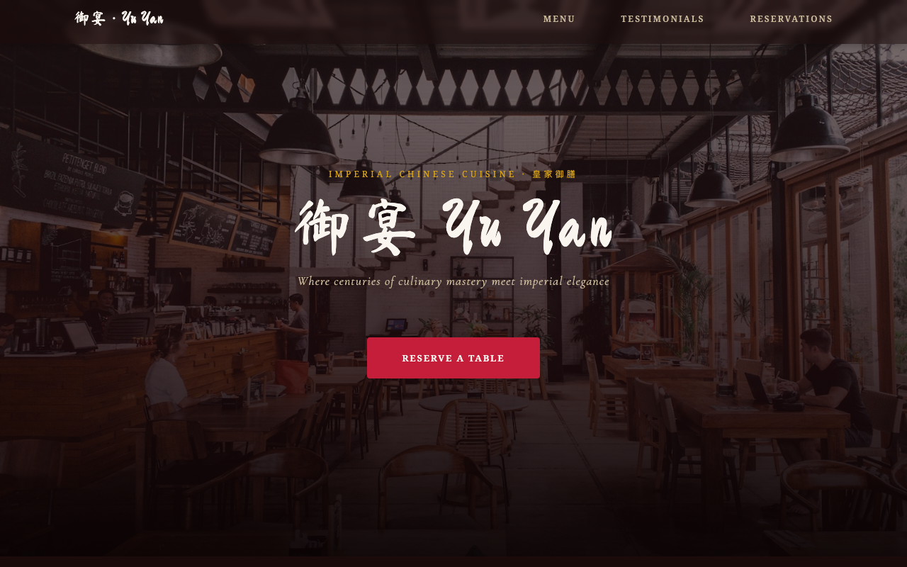

# 御宴 Yu Yan

A single-page restaurant website for a high-class Imperial Chinese dining experience. Built with vanilla HTML, CSS, and JavaScript — no frameworks or dependencies.



## Live Site

[https://aahdooshjc.github.io/classdemorestaurant/](https://aahdooshjc.github.io/classdemorestaurant/)

## Features

- Responsive design (mobile-first, breakpoints at 480px / 768px / 1024px / 1280px)
- Smooth scroll-triggered fade-in animations via IntersectionObserver
- Mobile hamburger nav with body scroll lock and Escape-to-close
- Testimonials carousel with auto-play, prev/next controls, and pause on hover
- Reservation form with client-side validation and success confirmation
- WhatsApp floating chat button with pulse animation and tooltip
- Accessible — ARIA attributes on interactive elements, `prefers-reduced-motion` respected

## Structure

```
index.html   — all markup and content
styles.css   — all styling (CSS custom properties for design tokens)
script.js    — all interactivity (six self-contained init functions)
```

## Running Locally

Open `index.html` directly in a browser — no build step required.

Or use a local dev server:

```bash
npx serve .
# or
python3 -m http.server 8080
```

## Deployment

Deployed automatically to GitHub Pages via GitHub Actions on every push to `main`.
